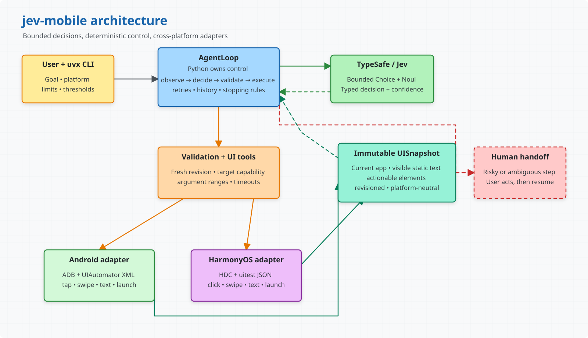

# jev-mobile

[English](README.md) | [简体中文](README_zh.md)

Control Android and HarmonyOS devices with bounded, inspectable natural-language agent loops powered by [TypeSafe/Jev](https://typesafe.ai/).

`jev-mobile` observes the current UI hierarchy, preserves visible information, asks Jev to select one typed action, validates that action against the latest snapshot, and executes it through ADB or HDC. Device access, retries, stopping rules, and side effects remain under deterministic Python control.



[Open the editable Excalidraw source](docs/jev-mobile-architecture.excalidraw).

## Demo

### Android

<video src="docs/demos/android-demo.mp4" controls="controls" preload="metadata"></video>

[Open the Android demo video](docs/demos/android-demo.mp4).

### HarmonyOS

<video src="docs/demos/harmonyos-demo.mp4" controls="controls" preload="metadata"></video>

[Open the HarmonyOS demo video](docs/demos/harmonyos-demo.mp4).

## Highlights

- Android support through ADB and HarmonyOS support through HDC.
- Platform-neutral UI snapshots containing actionable elements and visible static text.
- A bounded action set: start app, click, long-click, swipe, type, wait, hand off, or finish.
- Revisioned snapshots that reject stale element references after the UI changes.
- Configurable confidence thresholds, retry limits, and human handoff.
- No unrestricted shell access exposed to the model.
- Unit tests run without a physical device or live TypeSafe request.

## How It Works

1. Capture the foreground app and its UI hierarchy.
2. Normalize platform-specific nodes into a shared element model.
3. Send the goal, visible text, recent actions, and bounded choices to Jev.
4. Validate the selected action and target against the current snapshot.
5. Execute through the platform adapter, then observe the UI again.

Static text is included as observation context but is never offered as an action target unless the underlying element is enabled and supports that action.

## Requirements

- [`uv`](https://docs.astral.sh/uv/)
- A [TypeSafe API key](https://console.typesafe.ai/)
- A connected Android device with `adb`, or a HarmonyOS device with `hdc`
- Python 3.10 or newer, managed automatically by `uv` when needed

Set your TypeSafe API key:

```sh
export TYPESAFE_API_KEY='<your TypeSafe API key>'
```

The CLI checks authentication before accessing the device.

## Install and Run

Run `jev-mobile` directly with `uvx`. It installs the package in an isolated environment and reuses the cached installation on later runs:

```sh
uvx jev-mobile run --help
```

No repository clone or project virtual environment is required for CLI usage.

## Usage

> **Important: Jev does not generate text.** The CLI does not extract or invent text values from the task description. When a task requires typing into an editable field but no explicit value is available, the agent stops automatic interaction and requests human handoff. Follow the terminal's `HANDOFF` reason and `ACTION` instruction, enter the text directly on the device, then press Enter so the agent can observe the UI again and continue.

Give the agent both a task and an observable completion condition. This makes finishing behavior more reliable than a goal such as "open Settings" alone.

### Android

```sh
uvx jev-mobile run \
  "Open Settings and view battery information." \
  --platform android \
  --device emulator-5554
```

### HarmonyOS

```sh
uvx jev-mobile run \
  "Open Settings and view battery information." \
  --platform harmonyos \
  --device 127.0.0.1:5557
```

The `--device` option is optional when ADB or HDC can select the intended device by default.

## HarmonyOS App Allowlist

HarmonyOS normally discovers launchable apps from installed bundle metadata. Discovery includes enabled PAGE abilities registered for the home screen and selects the bundle's declared main element when several abilities match.

Use `--app BUNDLE/ABILITY[=LABEL]` to replace discovery with an explicit allowlist. Repeat the option when the task may open more than one app:

```sh
uvx jev-mobile run \
  "Open Settings and view battery information." \
  --platform harmonyos \
  --device 127.0.0.1:5557 \
  --app com.huawei.hmos.settings/com.huawei.hmos.settings.MainAbility=Settings
```

## Confidence and Handoff

Confidence values are probabilities between `0` and `1`. For example:

```sh
uvx jev-mobile run \
  "Open Settings and view battery information." \
  --platform android \
  --device emulator-5554 \
  --action-confidence 0.2 \
  --argument-confidence 0.5 \
  --finish-confidence 0.9
```

| Option | Meaning | Default |
| --- | --- | ---: |
| `--action-confidence` | Minimum confidence for the next action | `0` |
| `--argument-confidence` | Minimum confidence for an element target or text value | `0` |
| `--finish-confidence` | Minimum confidence required to declare completion | `0` |
| `--uncertain-retries` | Re-observations before returning that human action is needed | `1` |
| `--reobserve-delay` | Seconds between uncertainty retries | `1` |

The agent invokes interactive human handoff only when Jev explicitly selects `handoff` or `handoff_text_input` as the next action. Click, long-click, and text-input actions no longer run through a separate risk judgment that can trigger handoff. During an interactive handoff, complete the requested action on the device and press Enter to continue. Exhausted uncertainty retries or a missing app match only return `needs_handoff`; they do not open an interactive prompt. Use `--no-handoff` to make explicit handoff actions return immediately as well.

Text input follows the same handoff flow. Jev can only select from bounded text values supplied explicitly by code; it cannot generate usernames, search terms, verification codes, or other free-form text. The current CLI has no option for supplying text values, so a required text-entry step prints a prompt similar to this:

```text
HANDOFF  Text input is required, but no text value was provided and Jev cannot generate one.
ACTION   Enter the required text in the visible field on the device, then return.
Press Enter after completing the action on the device:
```

Python API callers can provide `AgentTextInput` candidates through `AgentTask.text_inputs`; only then may the agent execute `type_text` automatically. Values marked as sensitive are not sent to Jev. With `--no-handoff`, the CLI does not wait for input and returns exit code `3` instead.

## CLI Reference

```sh
uvx jev-mobile run --help
```

Important run options:

| Option | Description |
| --- | --- |
| `--platform {android,harmonyos}` | Required device platform |
| `--device DEVICE` | ADB serial or HDC connect key |
| `--app BUNDLE/ABILITY[=LABEL]` | HarmonyOS launch allowlist entry; repeatable |
| `--adb-path PATH` | ADB executable path |
| `--hdc-path PATH` | HDC executable path |
| `--timeout SECONDS` | Device command timeout; default `15` |
| `--max-steps COUNT` | Maximum agent steps; default `30` |
| `--no-handoff` | Exit instead of prompting for human action |

## Exit Codes

| Code | Meaning |
| ---: | --- |
| `0` | Task completed |
| `1` | Agent or device operation failed |
| `2` | CLI or configuration error |
| `3` | Human action is required |
| `4` | Step limit reached |
| `130` | Interrupted by the user |

## Development

From a repository checkout:

```sh
uv sync
uv run pytest
```

Build distribution artifacts with:

```sh
uv build
```

Platform integrations should remain behind adapters, and tests should use sanitized hierarchy fixtures, fake adapters, and mocked Jev responses rather than requiring real devices or API credentials.

## Contributing

Issues and focused pull requests are welcome. Please include tests for behavior changes and keep device-, app-, locale-, and account-specific assumptions out of reusable package code.
