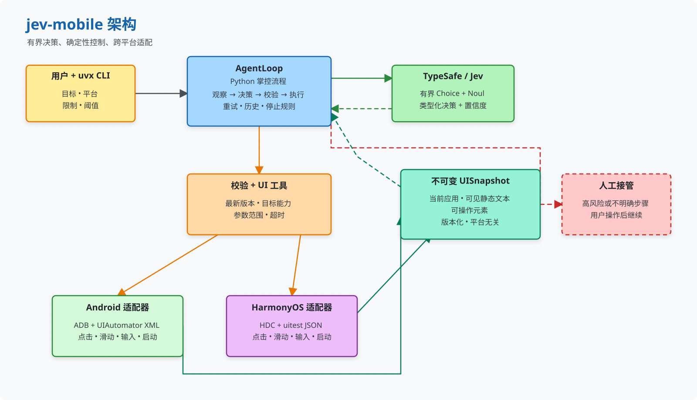

# jev-mobile

[English](README.md) | [简体中文](README_zh.md)

使用由 [TypeSafe/Jev](https://typesafe.ai/) 驱动、有明确边界且可检查的自然语言智能体循环，控制 Android 与 HarmonyOS 设备。

`jev-mobile` 观察当前 UI 层级，保留可见信息，让 Jev 选择一个类型化动作，根据最新快照校验动作，然后通过 ADB 或 HDC 执行。设备访问、重试、停止规则和副作用始终由确定性的 Python 代码控制。

https://github.com/user-attachments/assets/076bfab8-3d0e-49c8-9f6d-acec0fdbc643

https://github.com/user-attachments/assets/b6538548-2299-4075-8e64-c6003e55e8a7



[打开可编辑的 Excalidraw 源文件](docs/jev-mobile-architecture_zh.excalidraw)。

## 特性

- 通过 ADB 支持 Android，通过 HDC 支持 HarmonyOS。
- 使用统一的跨平台 UI 快照，同时包含可操作元素和可见静态文本。
- 动作集合有明确边界：启动应用、点击、长按、滑动、输入、等待、人工接管或完成。
- UI 变化后立即使旧快照失效，拒绝使用过期的元素引用。
- 支持配置置信度阈值、重试次数和人工接管策略。
- 不向模型暴露无限制的 Shell 执行能力。
- 单元测试无需真实设备或在线 TypeSafe 请求。

## 工作原理

1. 获取前台应用及其 UI 层级。
2. 将平台特有节点标准化为统一的元素模型。
3. 把任务目标、可见文本、最近动作和有界选项发送给 Jev。
4. 根据当前快照校验所选动作及其目标。
5. 通过平台适配器执行动作，然后重新观察 UI。

静态文本会作为观察上下文传给 Jev，但只有底层元素已启用且支持对应动作时，才会成为动作目标。

## 环境要求

- [`uv`](https://docs.astral.sh/uv/)
- [TypeSafe API Key](https://console.typesafe.ai/)
- 已连接的 Android 设备与 `adb`，或 HarmonyOS 设备与 `hdc`
- Python 3.10 或更高版本；需要时由 `uv` 自动管理

设置 TypeSafe API Key：

```sh
export TYPESAFE_API_KEY='<your TypeSafe API key>'
```

CLI 会在访问设备之前检查认证配置。

## 安装与运行

直接使用 `uvx` 运行 `jev-mobile`。`uvx` 会把软件包安装到隔离环境中，并在后续运行时复用缓存：

```sh
uvx jev-mobile run --help
```

使用 CLI 无需克隆仓库或创建项目虚拟环境。

## 使用方法

> **重要：Jev 不生成文本。** CLI 不会从任务描述中提取或编造要输入的内容。任务需要在可编辑字段中输入文本、但没有显式提供可用值时，智能体会停止自动操作并请求人工接管。请根据终端打印的 `HANDOFF` 原因和 `ACTION` 指引，直接在设备上完成输入，然后按 Enter 让智能体重新观察界面并继续。

请同时提供任务目标和可观察的完成条件。相比只说“打开设置”，明确的完成条件能让结束判断更加可靠。

### Android

```sh
uvx jev-mobile run \
  "打开设置，进入电池页面并查看电池使用信息。仅当可见界面显示电池页面和电池信息时才结束。" \
  --platform android \
  --device emulator-5554
```

### HarmonyOS

```sh
uvx jev-mobile run \
  "打开设置，进入电池页面并查看电池信息。仅当可见界面显示电池页面和电池信息时才结束。" \
  --platform harmonyos \
  --device 127.0.0.1:5557
```

当 ADB 或 HDC 能默认选择目标设备时，可以省略 `--device`。

## HarmonyOS 应用白名单

HarmonyOS 默认从已安装 Bundle 的元数据中发现可启动应用。发现逻辑只包含已启用、注册到桌面的 PAGE Ability；当多个 Ability 匹配时，会使用 Bundle 声明的主入口。

使用 `--app BUNDLE/ABILITY[=LABEL]` 可以用显式白名单替代自动发现。如果任务可能打开多个应用，可以重复传入该选项：

```sh
uvx jev-mobile run \
  "打开设置并查看电池信息。" \
  --platform harmonyos \
  --device 127.0.0.1:5557 \
  --app com.huawei.hmos.settings/com.huawei.hmos.settings.MainAbility=设置
```

## 置信度与人工接管

置信度参数必须是 `0` 到 `1` 之间的概率值。例如：

```sh
uvx jev-mobile run \
  "打开设置并查看电池信息。" \
  --platform android \
  --device emulator-5554 \
  --action-confidence 0.2 \
  --argument-confidence 0.5 \
  --finish-confidence 0.9
```

| 选项 | 含义 | 默认值 |
| --- | --- | ---: |
| `--action-confidence` | 下一步动作的最低置信度 | `0` |
| `--argument-confidence` | 元素目标或文本值的最低置信度 | `0` |
| `--finish-confidence` | 声明任务完成所需的最低置信度 | `0` |
| `--uncertain-retries` | 返回需要人工处理前的重新观察次数 | `1` |
| `--reobserve-delay` | 不确定性重试之间的等待秒数 | `1` |

只有 Jev 在主动作选择中明确选择 `handoff` 或 `handoff_text_input` 时，智能体才会调用交互式人工接管；点击、长按和文本输入不会再经过额外的风险判断而触发接管。交互式接管期间，请在设备上完成指定动作，然后按 Enter 继续。低置信度重试耗尽或找不到可启动应用时，智能体只返回 `needs_handoff`，不会弹出交互提示。无人值守环境可以使用 `--no-handoff` 让明确的 handoff 动作也直接返回。

文本输入遵循同一人工接管流程。Jev 只能从代码显式提供的有界文本值中选择，不能生成用户名、搜索词、验证码或其他自由文本。当前 CLI 没有提供文本值的选项，因此遇到必须输入文本的步骤时会打印类似以下提示：

```text
HANDOFF  Text input is required, but no text value was provided and Jev cannot generate one.
ACTION   Enter the required text in the visible field on the device, then return.
Press Enter after completing the action on the device:
```

Python API 调用方可以通过 `AgentTask.text_inputs` 提供 `AgentTextInput` 候选值；只有这种情况下，智能体才可能自动执行 `type_text`。标记为敏感的值不会发送给 Jev。使用 `--no-handoff` 时，CLI 不会等待输入，而是以退出码 `3` 返回。

## CLI 参考

```sh
uvx jev-mobile run --help
```

常用运行选项：

| 选项 | 说明 |
| --- | --- |
| `--platform {android,harmonyos}` | 必填的设备平台 |
| `--device DEVICE` | ADB 序列号或 HDC 连接键 |
| `--app BUNDLE/ABILITY[=LABEL]` | HarmonyOS 启动白名单条目，可重复使用 |
| `--adb-path PATH` | ADB 可执行文件路径 |
| `--hdc-path PATH` | HDC 可执行文件路径 |
| `--timeout SECONDS` | 设备命令超时，默认 `15` |
| `--max-steps COUNT` | 智能体最大执行步数，默认 `30` |
| `--no-handoff` | 需要人工操作时退出，而不是等待输入 |

## 退出码

| 代码 | 含义 |
| ---: | --- |
| `0` | 任务完成 |
| `1` | 智能体或设备操作失败 |
| `2` | CLI 或配置错误 |
| `3` | 需要人工操作 |
| `4` | 达到最大步数 |
| `130` | 用户中断 |

## 开发

在仓库目录中运行：

```sh
uv sync
uv run pytest
```

构建发布产物：

```sh
uv build
```

平台特有逻辑应保留在适配器之后。测试应使用脱敏的层级结构 fixture、虚假适配器和模拟 Jev 响应，不应依赖真实设备或 API 凭据。

## 参与贡献

欢迎提交 Issue 和范围明确的 Pull Request。行为变更请同时补充测试，并避免在可复用的软件包代码中引入针对特定设备、应用、语言区域或账号的假设。
